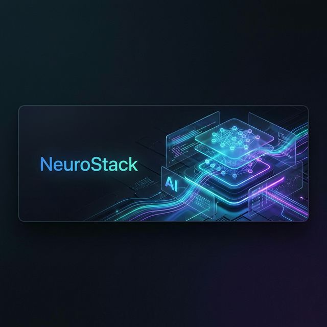
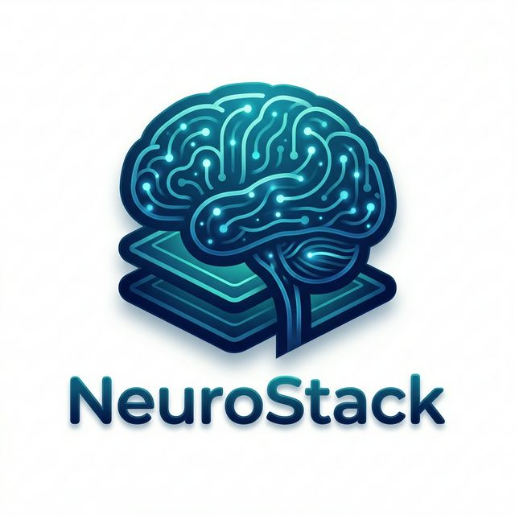

<p align="center">
  
</p>

# <p align="center">NeuroStack — AI Systems Mastery Platform</p>

<p align="center">
  
</p>

NeuroStack is a production-grade, multilingual AI learning platform designed to teach AI systems architectures (Transformers, MoE, Quantization) through interactive visual learning, adaptive roadmaps, and an embedded AI mentor.

## 📺 Demo Walkthrough

<!-- <p align="center">
  
</p> -->

**Tech Stack:**

| Layer | Technology |
|---|---|
| Backend | FastAPI, PostgreSQL, Async SQLAlchemy, Alembic, Pydantic, Celery (Eventlet) |
| Frontend | React 18, Vite, TailwindCSS (Neo-tactoid/Neumorphic design), Zustand |
| AI Services | Ollama (Local LLM), vLLM (Optional GPU Inference), Bhashini (Translation & TTS) |
| Infrastructure | Docker, Docker Compose, Nginx, Redis |

---

## Table of Contents

- [Architecture Overview](#architecture-overview)
- [Prerequisites](#prerequisites)
- [Way 1 — Docker Compose (One Command Start)](#way-1--docker-compose-one-command-start)
- [Way 2 — Docker Compose + vLLM GPU Server](#way-2--docker-compose--vllm-gpu-server)
- [Way 3 — Docker Compose + Ollama Container](#way-3--docker-compose--ollama-container)
- [Way 4 — Manual Local Setup (Without Docker)](#way-4--manual-local-setup-without-docker)
- [Database Setup & Migrations](#database-setup--migrations)
- [Seeding Data](#seeding-data)
- [Default Admin Credentials](#default-admin-credentials)
- [Using vLLM Instead of Ollama](#using-vllm-instead-of-ollama)
- [Environment Variables Reference](#environment-variables-reference)
- [API Documentation](#api-documentation)
- [Project Structure](#project-structure)
- [The 4 Development Phases](#the-4-development-phases)
- [Troubleshooting](#troubleshooting)

---

## Architecture Overview

```
                         ┌──────────────────┐
                         │   React Frontend  │ :80 (Docker) / :5173 (Dev)
                         │   Vite + Nginx    │
                         └────────┬─────────┘
                                  │ /api/*
                         ┌────────▼─────────┐
                         │  FastAPI Backend  │ :8000
                         │  Uvicorn ASGI     │
                         └──┬─────┬─────┬───┘
                            │     │     │
                   ┌────────▼┐  ┌─▼───┐ ┌▼──────────┐
                   │PostgreSQL│  │Redis│ │Ollama/vLLM│
                   │  :5432   │  │:6379│ │:11434/8001│
                   └──────────┘  └──┬──┘ └───────────┘
                                    │
                              ┌─────▼──────┐
                              │Celery Worker│
                              │(Translations)│
                              └─────────────┘
```

**Service Roles:**
- **PostgreSQL** — Primary database (users, topics, quizzes, translations, TTS audio cache)
- **Redis** — Celery message broker (db 0) and result backend (db 1)
- **Ollama** — Local LLM for AI quiz generation and semantic answer evaluation
- **vLLM** (Optional) — High-performance GPU inference server as Ollama alternative
- **Celery Worker** — Async background tasks (Bhashini translations, TTS generation)
- **Bhashini API** — Indian Government translation/TTS service (external, no setup needed)

---

## Prerequisites

### For Docker Setup (Way 1, 2, 3)

| Tool | Minimum Version | Install |
|---|---|---|
| Docker Desktop | 4.x+ | [docker.com/get-started](https://www.docker.com/get-started/) |
| Docker Compose | v2 (bundled with Docker Desktop) | Included with Docker Desktop |
| Git | Any | [git-scm.com](https://git-scm.com/) |

> **GPU users (vLLM/Ollama container):** Also install [NVIDIA Container Toolkit](https://docs.nvidia.com/datacenter/cloud-native/container-toolkit/install-guide.html) and ensure `nvidia-smi` works.

### For Manual Local Setup (Way 4)

| Tool | Minimum Version | Install |
|---|---|---|
| Python | 3.10+ | [python.org](https://www.python.org/downloads/) — add to PATH |
| Node.js | 18+ | [nodejs.org](https://nodejs.org/) — add to PATH |
| PostgreSQL | 14+ | [postgresql.org](https://www.postgresql.org/download/) |
| Redis | 7+ | Windows: via WSL (`sudo apt install redis-server`) |
| Ollama | Latest | [ollama.com/download](https://ollama.com/download) |
| Git | Any | [git-scm.com](https://git-scm.com/) |

---

## Way 1 — Docker Compose (One Command Start)

**This is the simplest way.** One command starts everything: PostgreSQL, Redis, Backend, Celery Worker, Frontend, runs migrations, and seeds the admin user. You only need Ollama running on your host machine.

### Step 1: Clone the Repository

```bash
git clone <your-repo-url> NeuroStack
cd NeuroStack
```

### Step 2: Configure Environment

```bash
# Copy the template
cp .env.example backend/.env
```

Edit `backend/.env` and set your values (or use the defaults for local development). The defaults work out of the box.

### Step 3: Start Ollama on Your Host Machine

Ollama needs to run on your host (outside Docker) to access your GPU directly.

```bash
# Install and pull the model (one-time, ~4.4GB download)
ollama pull mistral:7b

# Start the Ollama server (keep this running)
ollama serve
```

### Step 4: Launch Everything

```bash
docker compose up -d --build
```

**That's it.** This single command will:
1. Start PostgreSQL database (port 5432)
2. Start Redis broker (port 6379)
3. Build and start the FastAPI backend (port 8000)
4. Build and start the Celery background worker
5. Run all database migrations automatically
6. Create the default admin user
7. Build and start the React frontend via Nginx (port 80)

### Step 5: Access the Application

| Service | URL |
|---|---|
| Frontend | [http://localhost](http://localhost) |
| Backend API | [http://localhost:8000](http://localhost:8000) |
| Swagger Docs | [http://localhost:8000/docs](http://localhost:8000/docs) |
| Health Check | [http://localhost:8000/api/health](http://localhost:8000/api/health) |

### Managing the Stack

```bash
# View logs for all services
docker compose logs -f

# View logs for a specific service
docker compose logs -f backend

# Stop all services
docker compose down

# Stop and remove all data (volumes)
docker compose down -v

# Rebuild after code changes
docker compose up -d --build
```

---

## Way 2 — Docker Compose + vLLM GPU Server

Use this if you want a high-performance OpenAI-compatible GPU inference server instead of Ollama. Requires an NVIDIA GPU with 8GB+ VRAM.

### Step 1: Prerequisites

```bash
# Verify GPU is accessible to Docker
docker run --rm --gpus all nvidia/cuda:12.0-base nvidia-smi
```

### Step 2: Configure Environment

```bash
cp .env.example backend/.env
```

Edit `backend/.env` and change the Ollama URL to point to vLLM:

```env
# Point to vLLM instead of Ollama
OLLAMA_BASE_URL=http://vllm:8000
OLLAMA_MODEL=mistralai/Mistral-7B-Instruct-v0.3
```

If your model requires a Hugging Face token (gated models), set it in the shell:

```bash
export HF_TOKEN=hf_your_huggingface_token_here
```

### Step 3: Launch with vLLM Profile

```bash
docker compose --profile vllm up -d --build
```

This starts everything from Way 1 **plus** a vLLM container serving `Mistral-7B-Instruct-v0.3` on port 8001.

### Step 4: Verify vLLM is Running

```bash
# Check vLLM health
curl http://localhost:8001/v1/models

# You should see the model listed
```

### Customizing the vLLM Model

Change the model by setting `VLLM_MODEL` before launching:

```bash
export VLLM_MODEL=mistralai/Mistral-7B-Instruct-v0.3
export HF_TOKEN=hf_your_token
docker compose --profile vllm up -d --build
```

---

## Way 3 — Docker Compose + Ollama Container

Use this if you want Ollama to also run inside Docker (fully containerized). Requires an NVIDIA GPU accessible to Docker.

### Step 1: Launch with Ollama Profile

```bash
docker compose --profile ollama up -d --build
```

### Step 2: Pull the Model into the Container

After the Ollama container starts, pull the model:

```bash
docker exec -it neurostack-ollama ollama pull mistral:7b
```

### Step 3: Update Backend Config

Edit `backend/.env`:

```env
OLLAMA_BASE_URL=http://ollama:11434
OLLAMA_MODEL=mistral:7b
```

Then restart the backend:

```bash
docker compose restart backend celery-worker
```

> **Note:** If you don't have an NVIDIA GPU, remove the `deploy.resources` section from the `ollama` service in `docker-compose.yml` to run on CPU (slower but functional).

---

## Way 4 — Manual Local Setup (Without Docker)

This runs every service directly on your machine. You need **5 terminal windows**.

### Step 1: Clone the Repository

```bash
git clone <your-repo-url> NeuroStack
cd NeuroStack
```

### Step 2: Install and Start PostgreSQL

1. Install PostgreSQL from [postgresql.org](https://www.postgresql.org/download/)
2. During installation, set the password for the `postgres` user to `admin` (or update `backend/.env` to match)
3. Ensure the PostgreSQL service is running:
   - **Windows:** Check in Services (`services.msc`) — look for "postgresql-x64-XX"
   - **macOS:** `brew services start postgresql`
   - **Linux:** `sudo systemctl start postgresql`

4. Create the database:

```bash
cd backend
python -m venv venv

# Activate virtual environment
# Windows PowerShell:
.\venv\Scripts\activate
# macOS/Linux:
source venv/bin/activate

pip install -r requirements.txt
pip install celery[redis] redis eventlet httpx

# Create the neurostack database
python scripts/create_db.py
```

### Step 3: Install and Start Redis

**Windows (via WSL):**
```bash
# In a WSL terminal
sudo apt update && sudo apt install redis-server -y
sudo service redis-server start

# Verify
redis-cli ping
# Expected output: PONG
```

**macOS:**
```bash
brew install redis
brew services start redis
```

**Linux:**
```bash
sudo apt install redis-server -y
sudo systemctl start redis-server
sudo systemctl enable redis-server
```

### Step 4: Configure Environment Variables

```bash
# From the project root
cp .env.example backend/.env
```

Edit `backend/.env` — the defaults work for local development:

```env
POSTGRES_SERVER=localhost
POSTGRES_USER=postgres
POSTGRES_PASSWORD=admin
POSTGRES_DB=neurostack
POSTGRES_PORT=5432
OLLAMA_BASE_URL=http://localhost:11434
OLLAMA_MODEL=mistral:7b
```

### Step 5: Run Database Migrations

```bash
cd backend

# Activate venv if not already active
# Windows: .\venv\Scripts\activate
# macOS/Linux: source venv/bin/activate

# Run all migrations
alembic upgrade head
```

### Step 6: Create the Admin User

```bash
# From the project root directory
cd ..
python scripts/create_admin.py
```

Output: `Admin created: admin@neurostack.com / Admin123!`

### Step 7: Seed Sample Topics (Optional)

```bash
# From the project root directory
python scripts/seed_topics.py
```

### Step 8: Start All Services (5 Terminals)

#### Terminal 1 — FastAPI Backend

```bash
cd NeuroStack/backend

# Activate virtual environment
# Windows: .\venv\Scripts\activate
# macOS/Linux: source venv/bin/activate

uvicorn app.main:app --reload --port 8000
```

The API is now live at `http://localhost:8000`. Swagger docs at `http://localhost:8000/docs`.

#### Terminal 2 — Celery Worker

```bash
cd NeuroStack/backend

# Activate virtual environment
# Windows: .\venv\Scripts\activate
# macOS/Linux: source venv/bin/activate

# Set Python path (required)
# Windows PowerShell:
$env:PYTHONPATH="."
# macOS/Linux:
export PYTHONPATH=.

celery -A app.tasks.celery_app worker -l INFO -P solo
```

You should see Celery connect to Redis and list discovered tasks.

#### Terminal 3 — Ollama LLM

```bash
# First time: pull the model (~4.4GB download)
ollama pull mistral:7b

# Start the model (keeps it loaded in memory)
ollama run mistral:7b
```

Once you see the `>>>` prompt, the model is loaded and ready.

> **Troubleshooting:** If `ollama` is not recognized, close and reopen your terminal to refresh PATH. On Windows you can also use the absolute path: `& "$env:LOCALAPPDATA\Programs\Ollama\ollama.exe" run mistral:7b`

> **Timeout Error:** If you see `Error: timed out waiting for server to start`, start the daemon manually first: `ollama serve` in a separate terminal, then retry `ollama run mistral:7b`.

#### Terminal 4 — React Frontend

```bash
cd NeuroStack/frontend

# Install dependencies (first time only)
npm install

# Start Vite dev server with hot reload
npm run dev
```

Frontend is now live at `http://localhost:5173`.

#### Terminal 5 — Redis (Windows WSL only)

If Redis isn't running as a service:

```bash
# In WSL terminal
sudo service redis-server start
```

### Summary — Manual Setup URLs

| Service | URL |
|---|---|
| Frontend | [http://localhost:5173](http://localhost:5173) |
| Backend API | [http://localhost:8000](http://localhost:8000) |
| Swagger Docs | [http://localhost:8000/docs](http://localhost:8000/docs) |
| Health Check | [http://localhost:8000/api/health](http://localhost:8000/api/health) |
| Ollama API | [http://localhost:11434](http://localhost:11434) |

---

## Database Setup & Migrations

### How Migrations Work

NeuroStack uses **Alembic** for database schema management. Migration files are in `backend/alembic/versions/`.

| Migration | Description |
|---|---|
| `238013d7229d` | Initial users table (UUID, email, password_hash, role) |
| `c109c37a6911` | Topics and TopicContent tables |
| `e552e6fd2995` | Translation tables (TopicTranslation, TopicContentTranslation, UITranslation) |
| `25eaedd74d83` | Additional translation columns |
| `de1a09a1de4f` | TopicTTSAudio table (cached speech audio) |
| `6e6df1e6b1c5` | Quiz tables (Quiz, Question, QuizAttempt, QuestionResponse) |

### Running Migrations Manually

```bash
cd backend

# Activate virtual environment
# Windows: .\venv\Scripts\activate
# macOS/Linux: source venv/bin/activate

# Apply all pending migrations
alembic upgrade head

# Check current migration version
alembic current

# View migration history
alembic history

# Rollback one migration
alembic downgrade -1

# Rollback to specific revision
alembic downgrade 238013d7229d
```

### Running Migrations in Docker

```bash
# Migrations run automatically on `docker compose up`
# To run manually:
docker compose run --rm migrate
```

### Creating a Fresh Database

```bash
# If using Docker — reset everything:
docker compose down -v
docker compose up -d --build

# If manual setup:
cd backend
python scripts/create_db.py    # Creates the 'neurostack' database
alembic upgrade head            # Applies all migrations
cd ..
python scripts/create_admin.py  # Seeds admin user
python scripts/seed_topics.py   # Seeds sample topics (optional)
```

---

## Seeding Data

### Admin User

```bash
# Docker:
docker compose run --rm seed-admin

# Manual (from project root):
python scripts/create_admin.py
```

### Sample Topics

```bash
# Manual (from project root, with backend venv activated):
python scripts/seed_topics.py
```

This creates 6 sample topics across modules: Fundamentals, Deep Learning Basics, Computer Vision, Transformers, and Advanced LLMs.

---

## Default Admin Credentials

| Field | Value |
|---|---|
| Email | `admin@neurostack.com` |
| Password | `Admin123!` |

Use these to log in and access the Admin Dashboard, Topic Editor, Quiz Editor, and Translation Management panels.

---

## Using vLLM Instead of Ollama

[vLLM](https://docs.vllm.ai/) is a high-throughput inference engine that serves models via an OpenAI-compatible API. It provides significantly faster inference than Ollama for production workloads.

### Requirements

- NVIDIA GPU with 8GB+ VRAM (16GB+ recommended for 7B models)
- NVIDIA Driver 525+ and CUDA 12.0+
- Docker with NVIDIA Container Toolkit

### Option A: vLLM via Docker Compose (Recommended)

```bash
# Set your Hugging Face token (for gated models)
export HF_TOKEN=hf_your_token_here

# Start with vLLM profile
docker compose --profile vllm up -d --build
```

Update `backend/.env`:
```env
OLLAMA_BASE_URL=http://vllm:8000
OLLAMA_MODEL=mistralai/Mistral-7B-Instruct-v0.3
```

### Option B: vLLM Standalone (Without Docker)

```bash
# Install vLLM
pip install vllm

# Start the server
python -m vllm.entrypoints.openai.api_server \
    --model mistralai/Mistral-7B-Instruct-v0.3 \
    --dtype auto \
    --max-model-len 4096 \
    --gpu-memory-utilization 0.85 \
    --port 8001
```

Then update `backend/.env`:
```env
OLLAMA_BASE_URL=http://localhost:8001
OLLAMA_MODEL=mistralai/Mistral-7B-Instruct-v0.3
```

### Choosing a Model

| Model | VRAM Required | Quality | Speed |
|---|---|---|---|
| `mistralai/Mistral-7B-Instruct-v0.3` | ~8GB | Good | Fast |
| `meta-llama/Llama-3.1-8B-Instruct` | ~8GB | Very Good | Fast |
| `mistralai/Mixtral-8x7B-Instruct-v0.1` | ~24GB | Excellent | Medium |

> **Note:** The quiz generator and answer evaluator in NeuroStack send prompts to `/api/chat` (Ollama format). If using vLLM, ensure the model supports the OpenAI-compatible chat completions endpoint at `/v1/chat/completions`. You may need to adjust the endpoint paths in `backend/app/modules/quiz/generator.py` and `evaluator.py` to use vLLM's `/v1/chat/completions` format.

---

## Environment Variables Reference

All variables are set in `backend/.env`. See `.env.example` in the project root for a complete template.

| Variable | Default | Description |
|---|---|---|
| `PROJECT_NAME` | `NeuroStack API` | Application name shown in Swagger |
| `VERSION` | `1.0.0` | API version |
| `API_V1_STR` | `/api/v1` | API prefix |
| `BACKEND_CORS_ORIGINS` | `["http://localhost:5173", ...]` | Allowed CORS origins (JSON array) |
| `POSTGRES_SERVER` | `localhost` | PostgreSQL host (`postgres` in Docker) |
| `POSTGRES_USER` | `postgres` | Database username |
| `POSTGRES_PASSWORD` | `admin` | Database password |
| `POSTGRES_DB` | `neurostack` | Database name |
| `POSTGRES_PORT` | `5432` | Database port |
| `SECRET_KEY` | `dev-secret-123` | JWT signing key (change in production!) |
| `ALGORITHM` | `HS256` | JWT algorithm |
| `ACCESS_TOKEN_EXPIRE_MINUTES` | `30` | Access token lifetime |
| `REFRESH_TOKEN_EXPIRE_DAYS` | `7` | Refresh token lifetime |
| `BHASHINI_USER_ID` | — | Bhashini API user ID |
| `BHASHINI_API_KEY` | — | Bhashini API key |
| `BHASHINI_PIPELINE_ID` | — | Bhashini pipeline ID |
| `BHASHINI_PIPELINE_URL` | — | Bhashini config endpoint |
| `BHASHINI_INFERENCE_URL` | — | Bhashini inference endpoint |
| `BHASHINI_TTS_AUTH_TOKEN` | — | Bhashini TTS auth token |
| `OLLAMA_BASE_URL` | `http://localhost:11434` | Ollama/vLLM server URL |
| `OLLAMA_MODEL` | `mistral:7b` | Model name for quiz AI |
| `HF_TOKEN` | — | Hugging Face token (for vLLM gated models) |
| `VLLM_MODEL` | `mistralai/Mistral-7B-Instruct-v0.3` | vLLM model to serve |

---

## API Documentation

Once the backend is running, interactive API docs are available at:

- **Swagger UI:** [http://localhost:8000/docs](http://localhost:8000/docs)
- **ReDoc:** [http://localhost:8000/redoc](http://localhost:8000/redoc)

### Key Endpoints

| Method | Endpoint | Description | Auth |
|---|---|---|---|
| `POST` | `/api/v1/auth/register` | Register new user | Public |
| `POST` | `/api/v1/auth/login` | Login, get JWT token | Public |
| `POST` | `/api/v1/auth/logout` | Logout, clear cookies | Authenticated |
| `GET` | `/api/v1/topics/` | List all published topics | Public |
| `GET` | `/api/v1/topics/{slug}` | Get topic with content | Public |
| `POST` | `/api/v1/topics/` | Create topic | Admin |
| `PUT` | `/api/v1/topics/{id}` | Update topic | Admin |
| `DELETE` | `/api/v1/topics/{id}` | Delete topic | Admin |
| `GET` | `/api/v1/topics/{id}/audio` | Get TTS audio | Authenticated |
| `POST` | `/api/v1/quiz/` | Create quiz | Admin |
| `POST` | `/api/v1/quiz/generate/{topic_id}` | AI-generate quiz questions | Admin |
| `GET` | `/api/v1/quiz/topic/{topic_id}` | List quizzes for topic | Authenticated |
| `POST` | `/api/v1/quiz/{id}/start` | Start quiz attempt | Authenticated |
| `POST` | `/api/v1/quiz/attempt/{id}/submit` | Submit quiz answers | Authenticated |
| `POST` | `/api/v1/translations/topic/{id}` | Trigger topic translation | Admin |
| `GET` | `/api/v1/translations/ui` | Get UI translation strings | Public |
| `GET` | `/api/health` | Health check | Public |

---

## Project Structure

```
NeuroStack/
├── docker-compose.yml          # Full stack orchestration
├── .env.example                # Environment template
├── README.md                   # This file
├── scripts/
│   ├── create_admin.py         # Seed admin user
│   └── seed_topics.py          # Seed sample topics
│
├── backend/
│   ├── Dockerfile              # Backend container image
│   ├── .dockerignore
│   ├── .env                    # Environment config (not committed)
│   ├── requirements.txt        # Python dependencies
│   ├── alembic.ini             # Alembic migration config
│   ├── alembic/
│   │   ├── env.py              # Migration environment (async)
│   │   └── versions/           # Migration files
│   ├── scripts/
│   │   └── create_db.py        # Create PostgreSQL database
│   └── app/
│       ├── main.py             # FastAPI application entry point
│       ├── config.py           # Pydantic settings (loads .env)
│       ├── database.py         # Async SQLAlchemy engine + session
│       ├── core/
│       │   └── security.py     # Password hashing + JWT helpers
│       ├── modules/
│       │   ├── auth/           # Authentication (register/login/logout)
│       │   │   ├── models.py   # User model (UUID, email, role)
│       │   │   ├── schemas.py  # Pydantic request/response schemas
│       │   │   ├── service.py  # CRUD logic
│       │   │   ├── dependencies.py  # OAuth2 + get_current_user
│       │   │   └── router.py   # Auth endpoints
│       │   ├── topics/         # Learning content engine
│       │   │   ├── models.py   # Topic + TopicContent models
│       │   │   ├── schemas.py
│       │   │   ├── service.py  # CRUD + translation + TTS logic
│       │   │   └── router.py
│       │   ├── quiz/           # Quiz & evaluation engine
│       │   │   ├── models.py   # Quiz, Question, Attempt, Response
│       │   │   ├── schemas.py
│       │   │   ├── service.py  # Quiz CRUD + attempt engine
│       │   │   ├── generator.py    # Ollama LLM question generation
│       │   │   ├── evaluator.py    # Multi-strategy answer grading
│       │   │   └── router.py
│       │   ├── translations/   # Multilingual support
│       │   │   ├── models.py   # Translation + TTS audio models
│       │   │   ├── bhashini.py # Bhashini API client
│       │   │   └── router.py
│       │   └── users/
│       │       └── router.py
│       └── tasks/
│           ├── celery_app.py       # Celery configuration (Redis broker)
│           └── translation_tasks.py # Background translation worker
│
└── frontend/
    ├── Dockerfile              # Multi-stage build (Node -> Nginx)
    ├── .dockerignore
    ├── nginx.conf              # Nginx config with API proxy
    ├── package.json            # Node dependencies
    ├── vite.config.ts          # Vite build configuration
    └── src/                    # React application source
```

---

## The 4 Development Phases

### Phase 1: Foundation & Auth
Sets up the foundational repository architectures. Features include secure JWT authentication, PostgreSQL database schemas, bcrypt password hashing, Vite+React frontend scaffolding, and the implementation of our custom highly-stylized Neo-tactoid/Neumorphic CSS design system.

### Phase 2: Core Topic Engine
The central learning management system layer. Features a rich `TopicViewer` that parses nested JSON arrays of technical content (Code, Math, Visuals, and Core Concepts). Includes an Administrative CMS panel to Draft, Edit, and Publish learning modules with cascading difficulty tagging.

### Phase 3: Multilingual UI & AI Translation
Integrates the Indian Government's Bhashini API. Features a 3-tier caching system (Redis -> Postgres -> API) routed through an asynchronous Celery worker. Provides fully automated Hindi/Telugu UI translation states. Includes an Admin Review dashboard to force-queue background translations and an automated Text-to-Speech (TTS) processor that generates and permanent-caches localized Base64 audio blobs for every Topic.

### Phase 4: AI Quiz & Evaluation Engine
An extensive self-testing ecosystem attached to the Topic Engine.
- **Learner Side:** Features a sleek quiz session timer interface supporting Multiple Choice, Text Areas, and Code Completion inputs, alongside deeply analytical Results screens.
- **Admin Side:** Features the AdminQuizEditor that allows complete manual construction of assessments OR automated AI drafting where Uvicorn prompts the local `mistral:7b` Ollama daemon to instantly generate relevant, targeted questions based strictly on a topic's content.
- **Evaluation:** Grading integrates direct string matching arrays alongside semantic "rubric grading" via the local LLM.

---

## Troubleshooting

### Docker Issues

**Port already in use:**
```bash
# Find what's using port 8000
# Windows:
netstat -ano | findstr :8000
# Linux/macOS:
lsof -i :8000

# Stop the conflicting process, or change the port in docker-compose.yml
```

**Containers not starting (check logs):**
```bash
docker compose logs -f backend
docker compose logs -f postgres
docker compose logs -f celery-worker
```

**Reset everything from scratch:**
```bash
docker compose down -v
docker compose up -d --build
```

### Database Issues

**"database neurostack does not exist":**
```bash
# Docker: This is handled automatically by the postgres container
# Manual: Run the database creation script
cd backend && python scripts/create_db.py
```

**"relation does not exist" (tables missing):**
```bash
# Run migrations
cd backend && alembic upgrade head

# Docker:
docker compose run --rm migrate
```

### Ollama Issues

**"ollama is not recognized":**
Close and reopen your terminal to refresh PATH. On Windows, you can use the absolute path:
```powershell
& "$env:LOCALAPPDATA\Programs\Ollama\ollama.exe" serve
```

**"timed out waiting for server to start":**
Start the daemon manually first in a separate terminal:
```bash
ollama serve
```
Then in another terminal:
```bash
ollama run mistral:7b
```

**Quiz generation returns empty/error:**
Ensure Ollama is running and the model is loaded:
```bash
curl http://localhost:11434/api/tags
# Should list mistral:7b
```

### Redis Issues

**"Error connecting to Redis":**
```bash
# Check if Redis is running
redis-cli ping
# Should return: PONG

# Windows (WSL):
sudo service redis-server start

# Linux:
sudo systemctl start redis-server
```

### Frontend Issues

**Blank page or API errors:**
Ensure the backend is running and CORS is configured. Check `backend/.env`:
```env
BACKEND_CORS_ORIGINS='["http://localhost:5173", "http://localhost:4173", "http://localhost:3000", "http://localhost:80", "http://localhost"]'
```

**npm install fails:**
```bash
# Clear npm cache and retry
rm -rf node_modules package-lock.json
npm install
```

## Author
**Wasim Akram Chowdhry**

- GitHub: [Wasim Akram Chowdhry](https://github.com/wasimakramchowdhry)
- LinkedIn: [Wasim Akram Chowdhry](https://www.linkedin.com/in/wasim-akram-chowdhry)
- Email: [waseemakramchaudhari@gmail.com](mailto:waseemakramchaudhari@gmail.com)

Experienced in chatbot development, conversational AI, and computer vision solutions, with a focus on platforms like IBM Watson, Google Dialogflow, and cutting-edge AI technologies. Always passionate about learning and sharing insights in the AI and machine learning space.